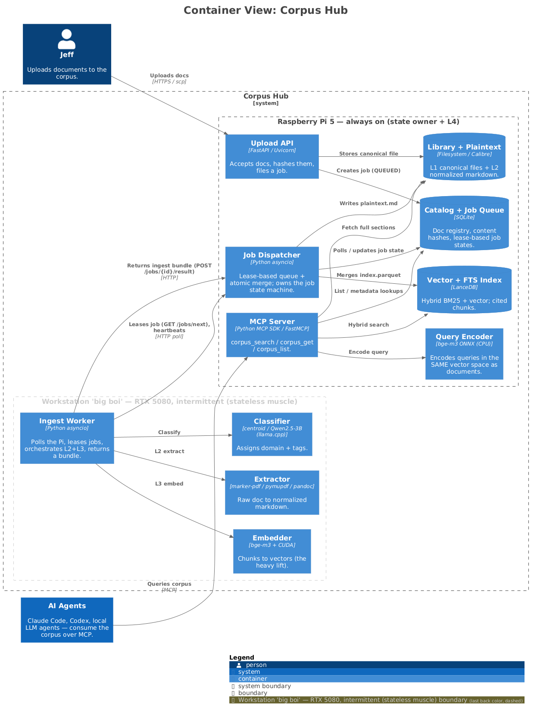
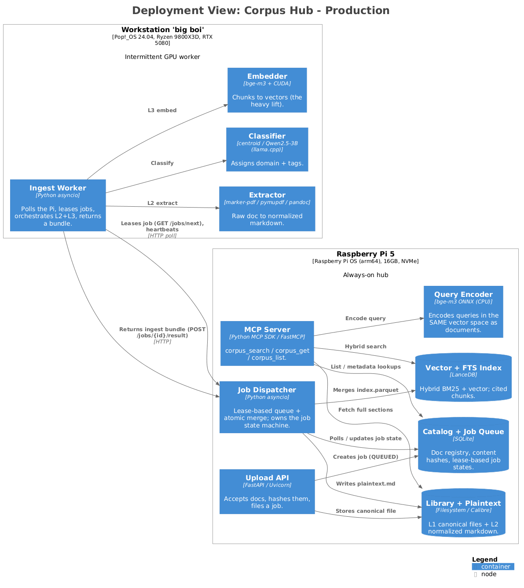
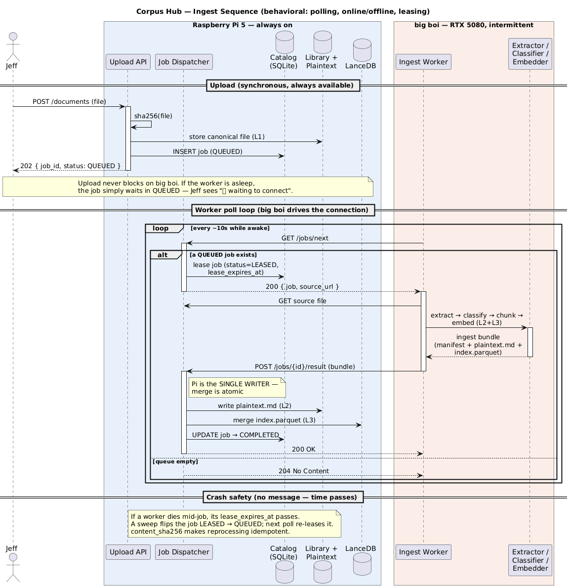

# Corpus Hub

A personal, AI-searchable document corpus. Drop ebooks and articles onto an
always-on **Raspberry Pi**; heavy extraction, classification, and embedding run
on an intermittent **RTX 5080 workstation** ("big boi"); results merge back to
the Pi, which serves hybrid (keyword + vector) search to any agent over **MCP** —
with citations back to the source page.

> **Status:** 📐 Design + planning. Implementation not started. See the plan at
> [`.hermes/plans/`](.hermes/plans/).

---

## Why it's built this way

The two machines have opposite availability, so the architecture leans into it:

- **Raspberry Pi — always on.** Owns *all* state: the upload API, the SQLite
  catalog + job queue, the LanceDB index, a CPU query encoder, and the MCP
  server. It is the **single writer**.
- **big boi (RTX 5080) — intermittent.** Stateless GPU muscle. A **pull-based
  worker** polls the Pi for jobs, runs extract → classify → chunk → embed, and
  ships a self-contained *ingest bundle* back. Nothing ever connects *to* it.

When big boi is asleep, uploads still succeed — jobs simply wait in `QUEUED`,
and retrieval keeps working because the Pi has its own query encoder. big boi
drains the queue whenever it wakes. That's the whole design in one sentence:
**the always-on node owns the truth; the flaky node is disposable muscle.**

## Architecture



**Ingest flow** (write side) and **query flow** (read side):




More views in [`docs/`](docs/): `SystemContext`, `Containers`,
`DeploymentView`, `IngestFlow`, `QueryFlow`, plus the behavioral
`sequence-ingest` diagram. All generated from
[`docs/workspace.dsl`](docs/workspace.dsl) (C4 model, Structurizr DSL).

Regenerate them with:

```bash
make diagrams        # or: bash docs/render.sh
```

## The four layers

| Layer | What | Where |
|-------|------|-------|
| **L1** | Canonical library (untouched originals) | Pi filesystem — Corpus Hub-managed (`library/<doc_id>/`); Calibre optional import source |
| **L2** | Normalized plaintext (Markdown + frontmatter) | produced on big boi, stored on Pi |
| **L3** | Vector + keyword index (hybrid BM25 + embeddings) | produced on big boi, merged into Pi's LanceDB |
| **L4** | MCP retrieval server (`corpus_search` / `get` / `list`) | Pi — always on |

## Quickstart (planned)

One command per machine — the Makefile auto-detects role by CPU arch (Pi vs
workstation) and brings up the right stack. **Containerized by default**, with an
automatic fallback to a local `uv` run if the container path fails (e.g. a GPU
image issue on big boi).

```bash
make init          # first run: .env + data dirs + Doppler setup
make start         # containerized; auto-falls-back to `make start-local` on failure
make start-local   # force the uv-on-host path (no containers)
make logs          # tail
make stop          # tear down
make test          # unit tests (uv + pytest)
make diagrams      # regenerate C4 diagrams
```

Secrets (the Pi's bearer token, future keys) live in **Doppler**, never in git
or `.env`; every runtime target is wrapped in `doppler run --`.

## Tech stack

Python 3.12 · uv workspace · FastAPI/Uvicorn · SQLite (lease-based job queue) ·
LanceDB (hybrid search) · bge-m3 (CUDA embed on the worker, ONNX-CPU query
encoder on the Pi) · marker-pdf / pymupdf / pandoc · Qwen2.5-3B classifier ·
FastMCP · Pydantic v2 (shared contract) · Doppler · Docker + Make.

## Repo layout

```
corpus-hub/
├── packages/contracts/   # shared Pydantic models (both ends import these)
├── pi/                   # always-on hub: upload+job API, dispatcher, encoder, search, MCP
├── worker/               # big boi: pull loop + extract/classify/chunk/embed pipeline
├── deploy/               # compose files + role detection / local-run scripts
└── docs/                 # C4 diagrams + Structurizr DSL + render script
```

## License

Private / personal project.
